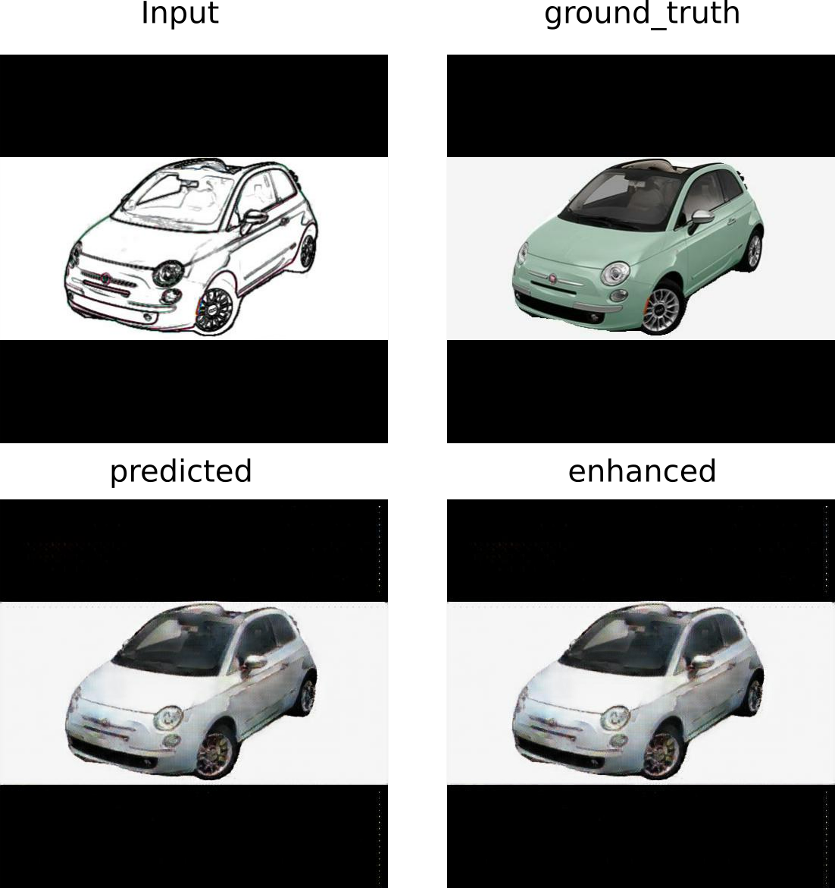
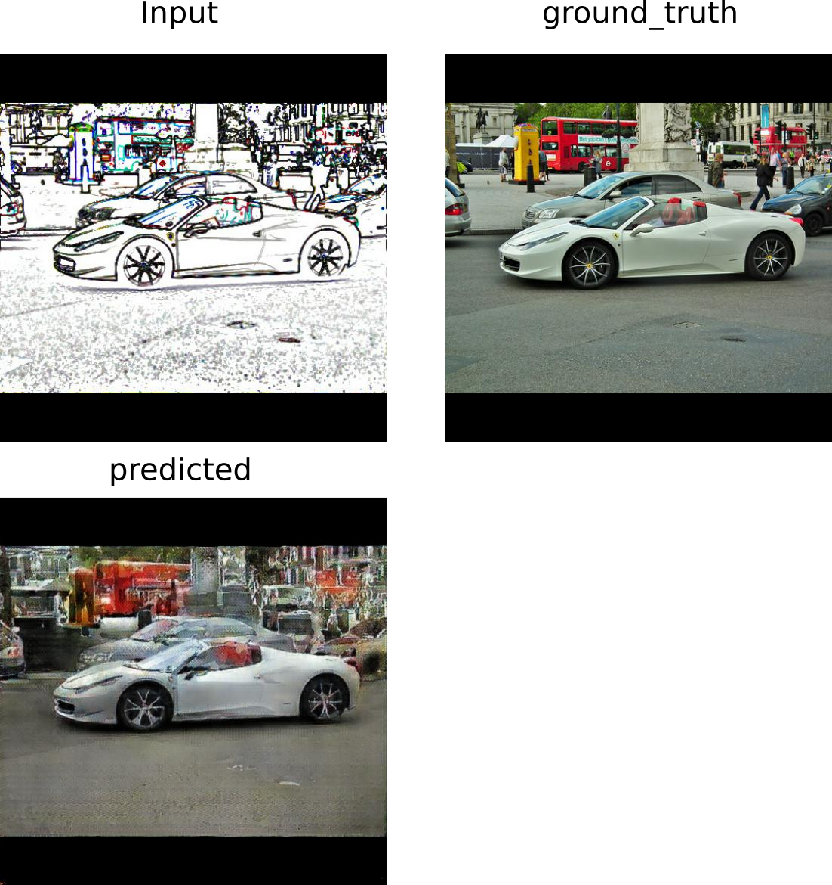
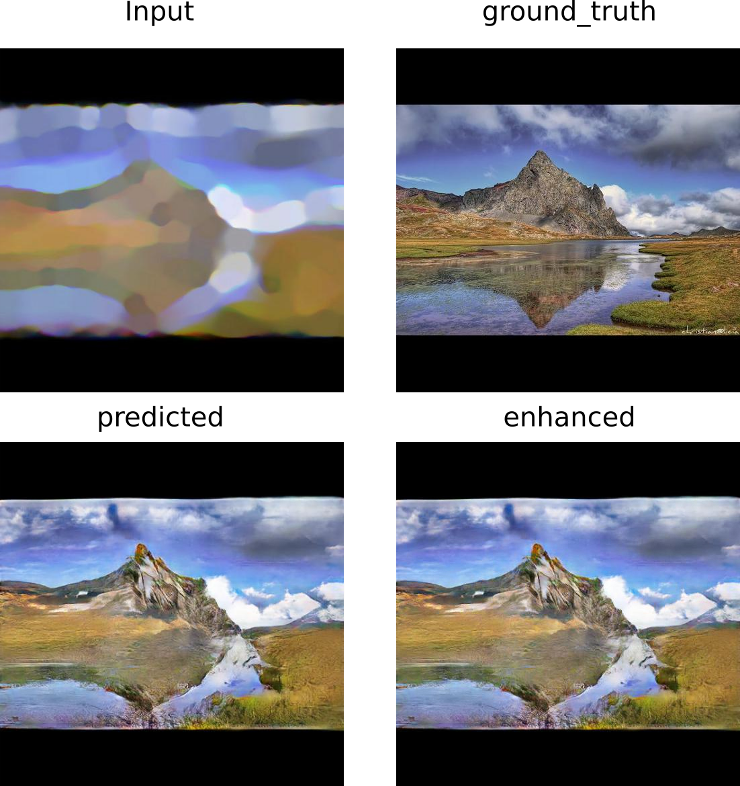

# Pix2Pix

Este proyecto implementa una pix2pix para dos tipos de aplicaciones, creación de paisajes a partir de imágenes sencillas y coloreado de carros apartir de su contorno.

El proyecto desarrollado toma una imagen simple (contornos en el caso de los carros o un sencillo paisaje) de 512 x 512 pixeles y los transforma en una imagen de 512 x 512 pixeles con color y muchos detalles, posteriormente y usando la Enhacenet descrita en https://github.com/msmsajjadi/EnhanceNet-Code, se hace un proceso de mejora de la calidad de la imagen y se exporta una imagen de 2048 x 2048 pixeles.

# Problema
Los diseñadores industriales y artistas de diversos tipos, invierten una gran cantidad de tiempo en la materialización de sus ideas (diseños 3D, composición de paisajes, entre otros) lo que nos les permite explorar muchas de sus ideas por la manera en que actualmente se puede estar realizando este proceso.

Para abordar este problema este proyecto propone una herramienta de apoyo para dibujo de paisajes y diseño de automóviles con generación de imágenes de alta calidad (2048 x 2048 pixeles). 

# Valor del proyecto
Este proyecto tiene amplio valor en las áreas artísticas y de diseño industrial, ya que con la interacción de nuevas herramientas computacionales se ha cambiado la forma de pensar, imaginar y desarrollar nuevos prototipos y obras de arte, ahora tenemos la posibilidad de interactuar con redes que nos permiten crear cosas que tal vez sin su intervención no hubiésemos podido lograr. Este proyecto no sólo se limita a ser utilizado en áreas de trabajo, sino también de forma lúdica con pequeños y grandes, y a interactuar de forma constructiva con herramientas computacionales.

# Preparación de datos
Para este proyecto se utilizaron dos bases de datos, una para carros y otra para paisajes.

Para el proceso de segmentación que se describe a continuación, se hace uso de la red descrita en: https://github.com/tensorflow/models/blob/master/research/deeplab/deeplab_demo.ipynb

#Proceso descargar y preprocesar la base de datos de carros con segmentación
1. Descargar [Stanford Cars Dataset](https://www.kaggle.com/jessicali9530/stanford-cars-dataset) train only
2. Unzip train Stanford Cars Dataset
3. Instalar awscli
4. Descargar Open Image Dataset V5 usando: aws s3 --no-sign-request sync s3://open-images-dataset/test [target_dir/test]
5. Copiar de Validation set a un nuevo folder sólo imágenes de carros: xargs -a cars_images.txt cp -t new_folder
6. Mezclar Stanford Cars Dataset y las imágenes de carros de Open Image Dataset V5 en u nuevo folder, ej: open_images_cars
7. Redimensionar las imágenes usando: find open_images_cars/ -iname '*.jpg' -exec convert \{} -verbose -resize 512x512\> \{} \; 
8. Segmentar las imágenes usando: python segmentation_images.py open_images_cars/
9. Copiar sólo las imágenes segmentadas a un nuevo folder, ej: cp -r open_images_cars/*_segmented.jpg open_images_cars_out
10. Copiar las imágenes redimensionadas a un nuevo folder para aplicarle un tratamiento: cp -r open_images_cars_out open_images_cars_in
11. Aplicar los filtros de imágenes utilizando gimp:
  11.1 Instalar gimp (sino lo tiene): sudo apt-get install gimp.
  11.2 Abrir y cerrar gimp (La primera vez gimp crea folders que necesitaremos)
  11.3 Make: cp cars-mask.scm ~/.gimp-2.8/scripts/
  11.4 Aplicar filtros a todas las imágenes que funcionarán como entrada para la red: find open_images_cars_in/ -iname '*.jpg' -exec gimp -i -b '(cars-mask "{}" 1 1 0 50.0 0.9)' -b '(gimp-quit 0)' \;

#Proceso descargar y preprocesar la base de datos de carros sin segmentación
1. Descargar [Stanford Cars Dataset](https://www.kaggle.com/jessicali9530/stanford-cars-dataset) train only
2. Unzip train Stanford Cars Dataset
3. Instalar awscli
4. Descargar Open Image Dataset V5 usando: aws s3 --no-sign-request sync s3://open-images-dataset/test [target_dir/test]
5. Copiar de Validation set a un nuevo folder sólo imágenes de carros: xargs -a cars_images.txt cp -t new_folder
6. Mezclar Stanford Cars Dataset y las imágenes de carros de Open Image Dataset V5 en u nuevo folder, ej: open_images_cars_out
7. Redimensionar las imágenes usando: find open_images_cars_out/ -iname '*.jpg' -exec convert \{} -verbose -resize 512x512\> \{} \; 
8. Copiar las imágenes redimensionadas a un nuevo folder para aplicarle un tratamiento: cp -r open_images_cars_out open_images_cars_in
9. Aplicar los filtros de imágenes utilizando gimp:
  9.1 Instalar gimp (sino lo tiene): sudo apt-get install gimp.
  9.2 Abrir y cerrar gimp (La primera vez gimp crea folders que necesitaremos)
  9.3 Make: cp cars-mask.scm ~/.gimp-2.8/scripts/
  9.4 Aplicar filtros a todas las imágenes que funcionarán como entrada para la red: find open_images_cars_in/ -iname '*.jpg' -exec gimp -i -b '(cars-mask "{}" 1 1 0 50.0 0.9)' -b '(gimp-quit 0)' \;

#Proceso descargar y preprocesar la base de datos de paisajes
1. Descargar [Landscape Pictures](https://www.kaggle.com/arnaud58/landscape-pictures).
2. Unzip Landscape Pictures en landscape_out
3. Redimensionar las imágenes usando: find landscape_out/ -iname '*.jpg' -exec convert \{} -verbose -resize 512x512\> \{} \; 
4. Copiar las imágenes redimensionadas a un nuevo folder para aplicarle un tratamiento: cp -r landscape_out landscape_in
5. Aplicar los filtros de imágenes utilizando gimp:
  5.1 Instalar gimp (sino lo tiene): sudo apt-get install gimp.
  5.2 Abrir y cerrar gimp (La primera vez gimp crea folders que necesitaremos)
  5.3 Make: cp landscape-mask.scm ~/.gimp-2.8/scripts/
  5.4 Aplicar filtros a todas las imágenes que funcionarán como entrada para la red: find landscape_in -iname '*.jpg' -exec gimp -i -b '(landscape-mask "{}" 35 35 40 20)' -b '(gimp-quit 0)' \;

Cada base de datos se utilizó para entrenar un determinado modelo y su requisito es que sean imágenes .jpg de 3 canales.

# Entrenamiento
Para entrenar el modelo se deben ingresar las imágenes de entrada a la red en el folder train_input, y las imágenes que idealmente debería predecir (ground truth) en train_desired_ouput o en su defecto indicar en el parámetro inpath y outpath los folders correctos y se debe ejecutar un comando como el siguiente configurando los parámetros correctos (o con los parámetros por defecto que trae el código):

python pix2pix_1.py --inpath "./train_input" --outpath './train_desired_output' --path_output "./output_model/" --predpath './image_to_pred_landscape' --pred_output "./image_predicted_landscape/" --flag_train 'True' --epochs 800 --checkpoint_dir './checkpoints' --restore 'False' --evolution_images 10 --batch_size_train 10 --batch_size_test 1 --img_width 512 --img_height 512 --img_aug 40 --output_channels 3 --_lambda 100

# Como usar el proyecto para hacer una prueba

Para probar estos modelos se debe de contar con dos ambientes virtuales:
  * Para correr pix2pix: tf_1_14_p_2_7.yml
  * Para correr enhancenet.py : tf_2_p_3.yml

  Para crear los ambientes virtuales anteriormente descritos se usa el comando:

  conda env create -f environment.yml

Una vez que se cumpla con los requisitos de software, se deben descargar los pesos de las redes disponibles en:
  * [Cars not segmented](https://drive.google.com/open?id=1GrjgkWxGiSLNjgdk-szl2jPi5ga0o85F)
  * [Cars segmented](https://drive.google.com/open?id=1jPTl618OqPnNi-USAme38KtIqrPWl8J1)  
  * [Landscapes](https://drive.google.com/open?id=1DNPq2SL1wCjFP8yPWUmQVjID1PmTZACZ)

Después se deben ubicar los folders descomprimidos en el folder desde el cual se va a correr el código, esto permitirá hacer el restore de los pesos entrenados previamente.

Desde una terminal se debe ejecutar el comando:

bash run.sh

este hará que todas las imágenes dentro de los folders image_to_pred_car_segmented, image_to_pred_car_not_segmented e image_to_pred_landscape sean tratadas por la red y se genere una salida por cada imagen en los folders image_predicted_car_segmented, image_predicted_car_not_segmented e image_predicted_landscape. Posteriormente se realiza el proceso de mejora de la imagen lo que genera salidas en una dimensión 4 veces mayor en los folders enhance_image_car_segemented, enhance_image_car_not_segemented y enhance_image_landscapes.

# El bash consiste en:

Activar el ambiente virtual para correr el modelo pix2pix:

source ~/anaconda2/etc/profile.d/conda.sh
conda activate tensorflow-keras

Hacer una llamado a la red pix2pix para generar paisajes apartir de las imágenes en ./image_to_pred_landscape

python pix2pix_1.py --inpath "./train_input" --outpath './train_desired_output' --path_output "./output_model/" --predpath './image_to_pred_landscape' --pred_output "./image_predicted_landscape/" --flag_train 'False' --epochs 800 --checkpoint_dir './checkpoints_landscape/ckpt-21' --restore 'True' --evolution_images 10 --batch_size_train 10 --batch_size_test 1 --img_width 512 --img_height 512 --img_aug 40 --output_channels 3 --_lambda 100 

Desactivar el ambiente virtual

conda deactivate

Activar el ambiente virtual para correr enhancenet.py

Hacer un llamado a la red enhancenet para sacar imágenes con mayor resolución.

python2.7 enhancenet.py --path_input './image_predicted_landscape' --path_output './enhance_image_landscape'

Desactivar el ambiente virtual

# Resultados
Nota importante: en los folders image_predicted hay resultados de imágenes generadas con dibujos hechos a mano.

# Resultados visuales

Generación de carros segmentados

Generación de carros no segmentados

Generación de paisajes

# Resultados gif evolutivo

Generación de carros segmentados

Generación de carros no segmentados

Generación de paisajes

